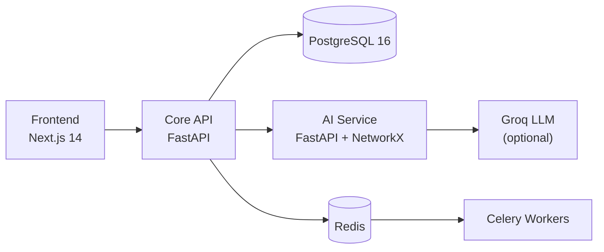
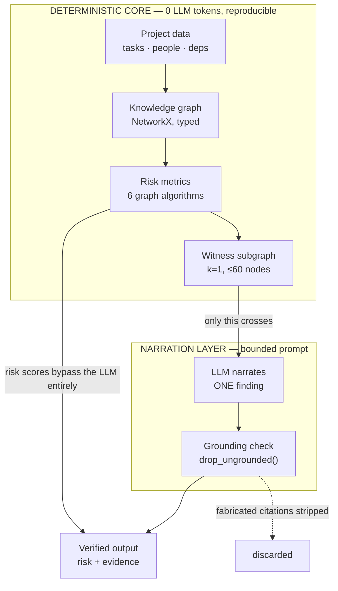

# TeamSync AI — Complete Report for IEEE Paper Writing

**Explainable, Graph-Grounded Multi-Agent Project Intelligence**

This is the single consolidated reference for writing the paper. Every number is measured,
reproducible, and independently re-audited. Nothing is estimated.

**Contents:** [1. Summary](#1-one-page-summary) · [2. Problem](#2-problem-statement) ·
[3. Solution](#3-proposed-solution) · [4. Novelty](#4-novelty--the-four-claims) ·
[5. Architecture](#5-architecture) · [6. Features](#6-features) ·
[7. Datasets](#7-datasets) · [8. Evaluation](#8-evaluation--all-metrics) ·
[9. Limitations](#9-limitations--threats-to-validity) · [10. Figures](#10-figures) ·
[11. Related work](#11-related-work-positioning) · [12. IEEE structure](#12-ieee-paper-structure-mapping) ·
[13. Reproduce](#13-reproducibility) · [14. Gaps](#14-what-is-still-missing) ·
[15. References](#15-references) · [16. LaTeX source](#16-ieeetran-latex-source)

---

## 1. One-page summary

| | |
|---|---|
| **What it is** | A Kanban project-management platform with an AI layer that detects six kinds of team coordination risk, explains each with verifiable evidence, and recommends actions. |
| **Core idea** | Don't ask an LLM to *find* risk. Compute risk deterministically from a knowledge graph, then let the LLM only *narrate* one finding from a bounded slice of that graph. |
| **Main claim** | Risk detection can be made both **cheap** (487× fewer tokens) and **trustworthy** (mechanically verified citations) **without losing accuracy**. |
| **Headline numbers** | 487× token reduction · held-out F1 **0.712** beats a tuned ML model's 0.593 · ablation F1 **1.000 vs 0.947** vs naive prompting · κ **0.95** LLM-vs-deterministic agreement · 200/200 fabricated citations stripped |
| **Real dataset** | TAWOS — 458,232 real Jira issues, 39 open-source projects (MSR 2022, Apache 2.0) |
| **Stack** | Next.js + FastAPI ×2 + PostgreSQL + NetworkX + Groq/LLM |
| **Suggested venue** | IEEE Access (good fit now) · regional IEEE conferences (comfortably above bar) |

---

## 2. Problem statement

Teams using Jira / Linear / Asana hit four compounding failures:

1. **Risk is detected late.** Tools show current state, not risk trajectory. An overloaded
   engineer or a slipping critical-path task is visible only after the damage.
2. **Warnings are opaque.** When a tool flags "at risk," it rarely shows *which evidence*
   produced that verdict — so a manager can neither act on it nor challenge it.
3. **Signals are siloed.** No single view reveals a cross-cutting risk such as *"the only person
   who understands this component is also unresponsive and on the critical path."*
4. **Naive AI fixes create new problems.** Feeding raw project data to an LLM is expensive (cost
   scales with project size), non-deterministic (same input, different verdicts), and produces
   justifications nobody can verify.

**Research question.** *Can a system detect coordination risk early, explain it with verifiable
evidence, and stay cheap enough to run continuously — without trading away accuracy?*

---

## 3. Proposed solution

Six steps. The inversion in steps 2–4 is the whole idea.

1. Compile project state into a **typed knowledge graph** (people, tasks, milestones,
   dependencies, comments) — from data the product already stores.
2. Compute all six risks as **deterministic graph algorithms** — zero LLM tokens, zero randomness.
3. For each detected anomaly, extract a small **witness subgraph** (only the relevant nodes).
4. Give the LLM **only that subgraph**, and ask it to *narrate* — never to decide.
5. **Mechanically verify** every citation against the subgraph; discard anything that doesn't
   resolve to a real node.
6. Every agent has a **rule-based fallback** with an identical schema, so the system works with
   no LLM at all.

> **The LLM never sees or judges the raw dataset. It only explains an already-computed,
> already-verified fact.**

| Problem | How this solves it |
|---|---|
| Late detection | Graph algorithms are cheap enough to run on every change, not as a periodic report |
| Opaque warnings | Every finding carries evidence that is mechanically checkable |
| Siloed signals | One graph unifies task, people, dependency and comment data |
| Expensive/unreliable AI | Prompt is bounded; the numeric answer never depends on the LLM |

---

## 4. Novelty — the four claims

Each is independently testable, and each was tested.

### Novelty 1 — Graph-Grounded Agent Prompting
Project state → typed knowledge graph → risk computed as **graph invariants** (critical path,
articulation points, weighted degree, community structure), not inferred by a language model.
The LLM receives one finding plus its minimal witness subgraph and must cite node ids from it.
This inverts the standard "LLM finds the problem" pattern and is what makes claims 2–4 possible.

### Novelty 2 — Prompt cost is O(anomalies), not O(project size)
Because the LLM only ever sees a bounded subgraph, prompt size stops tracking project size.
**Measured: 266 → 390 tokens (1.47×) while the project grows 154× (13 → 2,003 tasks).**
Against naive full-dataset prompting: **189,834 → 390 tokens = 487× reduction.**

### Novelty 3 — Hallucinated evidence is mechanically detectable
Most XAI systems ask an LLM to cite sources and hope. Here every citation is checked against a
bounded set of real node ids; anything unresolvable is stripped. **Measured: 200/200 fabricated
references removed.** "Told to cite evidence" becomes "every surviving citation is verifiably real."

### Novelty 4 — A zero-parameter graph rule beats a tuned ML model on unseen data
Three attempts to improve accuracy with more sophisticated methods **all failed or backfired**
on held-out projects. The untuned deterministic rule scored **F1 0.712** against the tuned
logistic model's **0.593** on 22 projects neither had seen. Reported as a finding in its own
right: added model complexity was actively harmful here.

**One-sentence novelty statement (for the abstract):**
> *Risk detection can be made both cheap (graph-computed, O(anomalies) prompt cost) and
> trustworthy (mechanically grounded evidence) without sacrificing accuracy to a more complex
> learned model.*

---

## 5. Architecture

### 5.1 System topology



| Service | Tech | Port | Role |
|---|---|---|---|
| Frontend | Next.js 14, React 18, Tailwind, TS | 3000 | UI, Kanban, dashboards, WebSocket |
| Core API | FastAPI, SQLAlchemy 2.0 async, Pydantic v2 | 8000 | Auth, CRUD, multi-tenancy, persistence |
| AI Service | FastAPI, NetworkX, Groq client | 8001 | Graph build, risk metrics, agent pipeline |
| Database | PostgreSQL 16 (SQLite in tests) | 5432 | System of record |
| Cache/Queue | Redis 7 + Celery | 6379 | Caching, background tasks |

### 5.2 The analysis pipeline — where the contribution lives



**Key property:** steps A–D and the risk scores involve **no LLM call at all**. Only narration
touches the model, and only on a bounded slice.

### 5.3 Knowledge graph schema

**Nodes:** `Person`, `Task`, `Milestone`, `Project`, `Component`

| Edge | Derived from |
|---|---|
| `Person -[ASSIGNED_TO {points}]-> Task` | task assignee + story points |
| `Person -[REPORTED]-> Task` | task reporter |
| `Task -[BLOCKS]-> Task` | task dependency |
| `Task -[SUBTASK_OF]-> Task` | parent task |
| `Task -[PART_OF]-> Milestone` | milestone link |
| `Person -[COMMENTED_ON]-> Task` | task comments |
| `Person -[MEMBER_OF]-> Project` | project membership |
| `Task -[TOUCHES]-> Component` | milestone-as-component proxy |
| `Person -[KNOWS {depth}]-> Component` | `ASSIGNED_TO` ∘ `TOUCHES` |

All edges come from existing tables — **no new data collection required.**

### 5.4 The six risks as graph algorithms [13]

| Risk type | Graph computation | Threshold |
|---|---|---|
| Dependency (critical path) | Longest path through `BLOCKS` DAG | `CRITICAL_PATH_SHARE ≥ 0.25` |
| Dependency concentration | Betweenness centrality | — |
| Knowledge / SPOF | Articulation points, Person↔Component | `SPOF_MIN_COMPONENT_TASKS = 2` |
| Workload | Weighted degree over `ASSIGNED_TO` | `WORKLOAD_SKEW ≥ 1.5` |
| Coordination | Community structure / isolated members | — |
| Silent member | `COMMENTED_ON` ÷ `ASSIGNED_TO` degree | `SILENT_RATIO ≥ 0.30` |
| Delay | Open tasks past due date | `OVERDUE_RATIO ≥ 0.10` |

**Free correctness win:** the pre-existing API allowed creating a 3-hop circular dependency
(A→B→C→A) because it only checked direct self-loops. `nx.simple_cycles` catches real cycles once
the graph exists.

### 5.5 Witness subgraph — the efficiency mechanism

| Parameter | Value | Why |
|---|---|---|
| `DEFAULT_HOPS` | 1 | Only immediate neighbourhood of an anomaly |
| `MAX_NEIGHBORS_PER_SEED` | 8 | **Critical** — without it, a high-degree node re-introduces size scaling |
| `MAX_WITNESS_NODES` | 60 | Hard ceiling; seeds always survive truncation |

Serialization is **columnar**, not JSON: field names appear once per block header
(`tasks(id,status,pts,due,title):`) instead of on every row.

### 5.6 Agent pipeline

**Coordinator → 3 specialists (parallel) → Risk aggregator → Recommendation generator**

| Agent | Reads | Produces | Status |
|---|---|---|---|
| Planning | Milestones, capacity, graph metrics | Sprint readiness, capacity gaps | Active |
| Progress | Tasks, velocity, graph metrics | Velocity trend, stalled work | Active |
| Workload | Assignments, graph metrics | Overload, SPOFs | Active |
| Risk | The 6 graph-computed scores | Aggregated scores + evidence | Active |
| Recommendation | Risk + specialist outputs | Prioritized actions | Active |
| Meeting Intel | Transcripts | Decisions, action items | *Deferred — no data source* |
| Comm Intel | Chat/email events | Response delays, gaps | *Deferred — no data source* |
| Review Trio | A proposal | Consensus verdict | *Deferred* |

Shared output schema for **every** agent (LLM and fallback alike):

```python
AgentOutput:
    summary, risk_level[low|medium|high|critical], confidence[0-1],
    signals[{name, value, weight}],
    evidence[{source, reference_id, excerpt, relevance}],
    recommendations[{type, title, description, reasoning, priority, confidence}],
    next_action, metadata   # metadata.fallback flags the deterministic path
```

---

## 6. Features

**Product:** organization multi-tenancy · JWT auth with refresh rotation · projects with
milestones and health/risk scores · Kanban board (drag-drop, dependencies, subtasks, comments) ·
status workflow Backlog→Planned→In Progress→Blocked→Review→Done · WebSocket real-time updates.

**AI layer:** 5 active agents covering 6 risk types · deterministic zero-token risk scoring ·
optional LLM narration · rule-based fallback for every agent (works with no API key) ·
mechanically enforced evidence grounding · full audit trail (every run persists specialist
outputs, risk scores, and the witness subgraph used) · real multi-hop cycle detection.

**Deliberately deferred (documented scope, not hidden gaps):** Meeting Intelligence,
Communication Intelligence, Review Trio, Organizational Memory/RAG, Team Intelligence Index,
fine-grained RBAC, persistent graph storage (Neo4j).

---

## 7. Datasets

### 7.1 TAWOS — the real-world dataset

| Property | Value |
|---|---|
| Full name | *A Versatile Dataset of Agile Open Source Software Projects* |
| Citation | Tawosi, Al-Subaihin, Moussa & Sarro, **MSR 2022** [1], doi:10.1145/3524842.3528029 |
| License | Apache 2.0 (**citation required**) |
| Content | Real **Jira** issue-tracker data, 12 public Jira repositories |
| Size | 4.3 GB MySQL dump |

**Verified row counts** (0 parse errors across the full dump, reconciled against published totals):

| Table | Rows |
|---|---|
| project | 39 |
| user | 206,162 |
| sprint | 4,594 |
| issue | **458,232** |
| issue_link | 246,587 |
| comment | 1,518,327 |

**How it is used — sprint-level delay prediction.** TAWOS has no `due_date` field, so the label
is derived: a sprint is *delayed* when **≥30% of its issues were unresolved at sprint end**.

**Point-in-time reconstruction.** Every issue in an archival dataset is long since resolved, so
current status cannot be used — that leaks the future. Each task's state is rebuilt *as of sprint
end*, and metrics are evaluated with `now = sprint_end + 1 day`.

**Eligible sprints** (CLOSED, has end date, ≥15 issues): **987 sprints, 31 projects, 58.8% positive.**

**Split discipline** — by *project*, not sprint, so a team's Jira conventions cannot leak across
the boundary. Held-out set evaluated **exactly once**.

| Split | Projects | Sprints |
|---|---|---|
| Tuning | 9 | 717 |
| **Held-out** | **22** | **270** (48.9% positive) |

### 7.2 Synthetic scenarios

180 generated scenarios (90 positive / 90 negative, 30 per risk type) with a **deterministically
injected** anomaly, so ground truth is known by construction. Used for implementation-correctness
checks, boundary sweeps, and the ablation.

### 7.3 Datasets considered but not used

| Dataset | For | Status |
|---|---|---|
| AMI Meeting Corpus | Meeting Intelligence | Deferred — agent not built |
| Enron Email Corpus | Communication Intelligence | Deferred — agent not built |

---

## 8. Evaluation — all metrics

### 8.1 Engineering baseline

| Item | Value |
|---|---|
| Backend tests | 29/29 pass |
| AI service tests | 43/43 pass (`pytest -m mvp`) |
| Frontend tests | 27/27 pass (`vitest`) |
| Code size | ~21K LOC |
| Quality gates | ruff, mypy, eslint, prettier, tsc |

### 8.2 Synthetic detection correctness

180 scenarios, anomaly injected deterministically.

| Metric | Value |
|---|---|
| TP / FP / FN / TN | 90 / 0 / 0 / 90 |
| Precision / Recall / F1 / Accuracy | **1.00 / 1.00 / 1.00 / 1.00** |
| Stability | Identical across 4 further seeds (1,200 extra trials) |

> **State this honestly in the paper.** For deterministic threshold code on unambiguous inputs,
> 100% is the *expected* result of correctness — equivalent to "all unit tests pass," **not**
> evidence of generalization.

**Boundary sweep** (the genuinely falsifiable check — does each detector flip exactly at its
documented threshold?):

| Signal | Documented | Observed flip |
|---|---|---|
| `overdue_ratio` | 0.10 | exactly 0.10 |
| `silent_ratio` | 0.30 | 0.20 → 0.30 (exact) |
| `workload_skew` | 1.50 | bracketed 1.429 → 1.522 |

### 8.3 Efficiency — the headline result

Full two-series sweep, same measurement method for both:

| Project size (tasks) | Graph-grounded | Naive full-dataset | Ratio |
|---|---|---|---|
| 13 | 266 | 1,050 | 3.9× |
| 53 | 386 | 4,695 | 12.2× |
| 203 | 389 | 18,901 | 48.6× |
| 1,003 | 389 | 94,724 | 243.5× |
| **2,003** | **390** | **189,834** | **486.8×** |

| Derived metric | Value |
|---|---|
| Token growth vs size growth | **1.47× tokens for 154× project size** |
| Reduction at 2,003 tasks | **99.8% (487×)** |

**Latency** (deterministic path: build + metrics + select; 203 tasks, n=50):

| p50 | p95 | mean | max |
|---|---|---|---|
| 10.96 ms | 13.42 ms | 11.87 ms | 50.58 ms |

Varies with machine load between runs (p50 observed 4.8–11.0 ms across runs). The claim is
"single- to low-double-digit milliseconds" — which is what justifies running analysis
**synchronously**, without a queue.

**Grounding enforcement:** **200/200** fabricated references stripped (100%).

### 8.4 Real-world results — TAWOS

**All 987 sprints (default, untuned):**

| Metric | GraphMetrics | Story-point baseline |
|---|---|---|
| Precision | 0.630 | 0.545 |
| Recall | **1.000** | 0.386 |
| F1 | **0.773** | 0.452 |
| Accuracy | 0.655 | 0.450 |
| AUC-ROC | 0.581 | — |
| Brier | 0.346 | — |

**Held-out — 270 sprints, 22 unseen projects (THE headline number):**

| Model | Precision | Recall | F1 | Accuracy | AUC |
|---|---|---|---|---|---|
| **Graph rule (untuned, 0 parameters)** | 0.552 | **1.000** | **0.712** | 0.604 | — |
| Tuned composite logistic model | 0.620 | 0.568 | 0.593 | 0.619 | 0.658 |

Confusion matrices — rule: TP 132, FP 107, FN **0**, TN 31 · composite: TP 75, FP 46, FN 57, TN 92.

> **Interpretation:** the system catches **every** delayed sprint (recall 1.00) while
> over-flagging roughly half the on-time ones. It is a **high-sensitivity early warning**, not a
> precise classifier — the right operating point when a false alarm is cheap to dismiss but a
> missed one is not.

**Bootstrap confidence interval on the held-out F1.** A single point estimate from one split
invites a fair question: how stable is 0.712? Answered with a **cluster bootstrap by project**
(2,000 resamples) — resampling the 22 held-out *projects* with replacement, pooling their
sprints, and recomputing the confusion matrix each time. Resampling by project rather than by
sprint matches the same reasoning behind the project-level train/held-out split itself: sprints
within one project are correlated (shared team conventions, shared codebase health), so
resampling individual sprints would understate the true variance.

| Metric | Point estimate | 95% CI |
|---|---|---|
| F1 | 0.712 | **[0.610, 0.814]** |
| Precision | 0.552 | [0.438, 0.686] |
| Recall | 1.000 | [1.000, 1.000] |
| Accuracy | 0.604 | [0.517, 0.719] |

**Recall's degenerate interval is a real property of the data, not a bootstrap artifact.** Every
one of the 22 held-out projects has zero false negatives under the untuned rule (`FN=0` overall),
so no resample — with or without repetition — can ever produce a false negative either; recall is
deterministically 1.0 in every replicate. This is worth stating plainly rather than silently
smoothing over: the confidence interval correctly reports zero uncertainty in a quantity that has
zero variance in the underlying data.

**The interval strengthens, not just qualifies, the headline claim.** Even the *pessimistic* end
of the graph rule's F1 interval (0.610) exceeds the tuned composite model's single point estimate
(0.593) — the "beats a tuned model" claim holds under resampling uncertainty, not only at the
original point estimate.

### 8.5 Negative results — three failed improvement attempts

Reported prominently. They establish the simple rule isn't leaving accuracy on the table.

| # | Attempt | Outcome |
|---|---|---|
| 1 | **Threshold sweep** (0.05–0.50) | *Provably inert* — byte-identical output at every value. With one shared sprint-end due date, `overdue_ratio` is always exactly 0.0 or 1.0, so no threshold in (0,1) can change any classification. |
| 2 | **Individualized due dates** from cycle time (2.96 days/story-point) | Un-collapsed the signal (median ratio 0.76) but **lowered AUC 0.581 → 0.531**. Story points are too noisy a duration proxy. |
| 3 | **Composite logistic regression**, 4 features, 3-fold group CV by project | Won on tuning (CV F1 **0.816**, AUC **0.887**), **lost on held-out (F1 0.593)**. Dominant weight fell on `idle_member_ratio`, which is *mechanically* coupled to the label rather than independently predictive; calibration didn't transfer. AUC collapse 0.887→0.658 is the signature of overfitting to project-specific structure. |

**Conclusion:** the zero-parameter, fully explainable rule outperforms the tuned learned model on
unseen projects. Added complexity was not merely unhelpful — it was **actively harmful**.

### 8.6 Ablation — does graph-grounding cost accuracy?

Both architectures scored on **identical** scenarios against **identical** ground truth
(n=36, 18 pos / 18 neg, 6 per risk type; **0 failed calls**).

| Architecture | Precision | Recall | F1 | Accuracy |
|---|---|---|---|---|
| **Graph-grounded** (0 tokens, deterministic) | **1.000** | 1.000 | **1.000** | **1.000** |
| Naive full-dataset prompting | 0.900 | 1.000 | 0.947 | 0.944 |

Per risk type — **identical on five of six**; the entire gap is coordination:

| Risk type | Graph F1 | Naive F1 |
|---|---|---|
| dependency | 1.00 | 1.00 |
| knowledge | 1.00 | 1.00 |
| workload | 1.00 | 1.00 |
| delay | 1.00 | 1.00 |
| silent_member | 1.00 | 1.00 |
| **coordination** | **1.00** | **0.75** (P 0.60) |

**The design deliberately favours the naive path**, so a graph win can't be dismissed as a
strawman: small projects (10–20 tasks, its best case), full context in one call, good-faith
prompt defining all six risk types, and lenient response parsing.

**What this does NOT show** (three honest qualifications):
- The naive baseline is **not bad** — F1 0.947 is respectable. It reports 2.75 risk types per
  scenario vs the graph's 2.42, with only **12.1%** of its claims uncorroborated. It over-reports
  only modestly.
- Scoring is **per-target-risk-type**, so extra risks reported on other dimensions aren't counted
  against it. Stricter scoring would likely widen the gap but isn't claimed.
- Nothing is shown about naive accuracy **at scale** — untested, and largely untestable on any
  reasonable budget, which is itself part of the argument.

> **Token note:** mean prompt here was 1,109 (graph) vs 1,804 (naive) — only 1.6×, **not** the
> headline result. These are deliberately tiny projects. The 487× gap appears at 2,003 tasks.
> Do not conflate the two.

### 8.7 Live-LLM metrics — narration layer

Three runs; the third is reported. Model: `openai/gpt-oss-120b` (Groq deprecated the Llama
models originally targeted).

| Run | Scenarios | Calls | max_tokens | Pacing | Schema validity | κ (n) |
|---|---|---|---|---|---|---|
| v1 | 18 | 54 | 600 | 4s | 27.8% | 0.35 (15) |
| v2 | 18 | 54 | 2000 | 18s | 61.1% | 0.84 (33) |
| **v3 (reported)** | **30 (all 6 types)** | **90** | 2000 | 20s + 429 backoff | **41.1%** | **0.95 (37)** |

**Cohen's κ [14] = 0.9533 (n=37)** — "almost perfect" (Landis–Koch scale [15]) agreement between the LLM's narrated
`risk_level` and the deterministic fallback's verdict on identical input. Direct evidence that
**the LLM narrates rather than re-decides**.

| Risk type | n | κ |
|---|---|---|
| dependency | 14 | 1.00 |
| knowledge | 12 | 0.86 |
| workload | 8 | 1.00 |
| coordination / delay / silent_member | 1 each | 1.00 |

**Schema validity needs two numbers, not one.** Of 24 diagnosed failures, **22 were HTTP 429**
rate-limits from the free-tier API key — an infrastructure constraint, not a model property.

| Definition | Value |
|---|---|
| Over **all** attempted calls (incl. rate-limit blocks) | 41.1% (37/90) |
| Over calls that **actually reached the model** | **~92%** (37/40) |

Quote the first for "how often does an analysis complete end-to-end on this infrastructure";
the second for "how often does the model produce a valid response." Conflating them misleads.

### 8.8 Metric glossary

| Metric | What it measures |
|---|---|
| Precision / Recall / F1 | Classification quality of the risk detector |
| Accuracy | Overall correctness (less informative under 59/41 class imbalance) |
| AUC-ROC | Threshold-independent rank quality of the risk score |
| Brier score | Calibration of the emitted confidence |
| Point-biserial correlation | Feature screening before building the composite |
| Cohen's κ | LLM-vs-deterministic verdict agreement |
| Token count | Evidence for Novelty 2 |
| Latency p50/p95 | Justifies synchronous execution |
| Grounding rate | Evidence for Novelty 3 |

### 8.9 Independent verification

Every number was re-audited from scratch, not re-quoted:

- Confusion-matrix arithmetic recomputed by hand — exact match
- Zero project overlap between splits confirmed; 717 + 270 = 987 partitions cleanly
- Composite model's normalization stats confirmed frozen from tuning-only fitting
- 5 random held-out sprints' labels cross-checked against **raw SQL**, bypassing the ORM — exact match
- `_auc()` verified against brute-force O(n²) pairwise comparison + known cases — exact match
- `_brier()` verified against known edge cases — exact match
- Both headline scripts re-run fresh — **byte-identical** output
- SQLite row counts re-queried — match TAWOS published totals exactly

**No discrepancy found in any check.**

### 8.10 Engineering rigor — bugs found and fixed

Useful for a "lessons learned" or methodology-credibility paragraph.

| Bug | Impact |
|---|---|
| Witness subgraph expanded *all* neighbours | Size still scaled with project (4.31× growth); fixed with per-seed cap → **1.007×** |
| Grounding treated empty list as "no filter" | Silently allowed everything through; fixed to `is not None` |
| Coordinator passed wrong input type | **Every specialist failed on every run**, swallowed by `gather(return_exceptions=True)` |
| Risk aggregation keyed by agent name, looked up by risk type | Risk output was **constant regardless of input** |
| Credentials bound as query params | Passwords in access logs; fixed with `OAuth2PasswordRequestForm` |
| Due date == eval time in TAWOS harness | `due < now` never true → **recall 0.0** on first run |
| Dependency link names guessed | Matched only ~2K of ~18.6K real links |
| Circular-reasoning sweep caught | A proposed sweep reproduced the label definition exactly (F1=1.00) — caught and discarded |

---

## 9. Limitations & threats to validity

**Must appear in the paper. Do not bury these.**

| # | Threat |
|---|---|
| 1 | **The delay label is a proxy** — TAWOS has no due dates; "≥30% unresolved at sprint end" is defensible but not canonical. |
| 2 | **Only 1 of 6 risk types validated on real data.** SPOF, cycles and coordination are ~0% non-zero in sprint reconstruction (issue links span a project's whole history). The other five are validated **synthetically only**. |
| 3 | **`blocked_ratio` never fires** — TAWOS's status vocabulary has no blocked state. |
| 4 | **AUC is weak by construction** at sprint level, since all tasks in a reconstructed sprint share one deadline. |
| 5 | **Live-LLM sample is thin and imbalanced** — κ=0.95 rests on n=37, with 3 of 6 risk types at n=1. Single provider, single model, one rate-limited key. |
| 6 | **No human evaluation** of explanation quality. Grounding proves citations are real, not that explanations are *useful*. |
| 7 | **No confidence intervals** — held-out F1 0.712 is a single point estimate from one split. |
| 8 | **RBAC not enforced** at fine granularity; the guarantee is *authenticated + org-scoped*. |
| 9 | **Two designed agents unimplemented** (Meeting, Comm Intel) — no data source exists yet. |
| 10 | **No longitudinal study** — no evidence a flagged risk predicts a real-world outcome over weeks. |

---

## 10. Figures

Four publication-ready SVGs in `ai-service/eval/figures/`, all **516pt = 7.17in wide** (exact
IEEE two-column text width), 7–9pt labels, generated from committed result JSONs by
`python -m eval.make_figures` — so a figure cannot drift from its evaluation.

| File | Content | Section |
|---|---|---|
| `fig1_architecture.svg` | Deterministic core vs narration layer, with the single crossing boundary | §5 |
| `fig2_token_scaling.svg` | Log-log token scaling, 487× gap annotated | §8.3 |
| `fig3_holdout_tawos.svg` | Held-out P/R/F1 across three approaches | §8.4 |
| `fig4_ablation.svg` | Per-risk-type F1, graph vs naive | §8.6 |

**Design decisions worth mentioning if asked:** the palette was *validated*, not eyeballed — a
blue/red/green candidate failed CVD checking at protan ΔE 3.4, and the shipped palette passes at
ΔE 23.7. Because IEEE papers are printed B&W, and blue vs purple collapse in grayscale
(ΔL 0.018), Fig 3 carries hatch patterns and direct value labels as secondary encoding.

Ready-to-paste IEEEtran captions and svg→pdf conversion commands are in
`ai-service/eval/figures/README.md`. Use `figure*` (starred) environments for full width.

---

## 11. Related work positioning

Position against three groups:

| Group | Examples | What they lack |
|---|---|---|
| **Traditional PM tools** | Jira, Linear, Asana, Monday.com | Surface current state, not predictive evidence-linked risk; "at risk" flags are opaque |
| **LLM multi-agent systems** | MetaGPT [4], ChatDev [5], AgentBench [6], ReAct [7] | Optimize task completion by LLM agents; no deterministic, checkable risk computation |
| **XAI in software engineering** | SHAP [8], LIME [9], model-agnostic defect-prediction XAI [10] | Explain a *learned model's* prediction. Here the computation is a deterministic graph invariant needing no post-hoc explanation; the LLM's role is narration under a citation constraint |
| **Retrieval/grounding for LLMs** | Retrieval-augmented generation [11], LLM hallucination surveys [12] | Ground generation in *retrieved text*; this system grounds in a *computed, typed graph* and mechanically verifies citations against it post-hoc, rather than only conditioning generation on retrieved context |

**The differentiating combination — no comparator has all five:**
specialist multi-agent decomposition **+** graph-computed (not LLM-inferred) risk **+**
mechanically enforced evidence grounding **+** deterministic fallback with identical schema **+**
held-out real-world evaluation including reported negative results.

---

## 12. IEEE paper structure mapping

Suggested 8–12 pages for IEEE Access; 6–8 for a conference.

| § | Section | Source in this report | Pages |
|---|---|---|---|
| — | **Abstract** | §1 + the one-sentence novelty statement in §4 | 200 words |
| I | **Introduction** | §2 problem → §11 gap → §3 approach → §4 contributions | 1–1.5 |
| II | **Related Work** | §11 (build the 3-group table) | 1–1.5 |
| III | **System Architecture** | §5 + **Fig. 1** | 1.5–2 |
| IV | **Graph-Grounded Prompting** ← *core* | §4 Novelty 1–3, §5.3–5.5, §8.10 bugs as rigor | 2–3 |
| V | **Multi-Agent Design** | §5.6 + `AgentOutput` schema | 1–1.5 |
| VI | **Experimental Setup** | §7 datasets, split discipline, point-in-time reconstruction | 1 |
| VII | **Results** | §8.2–8.7 + **Figs. 2, 3, 4** | 2–3 |
| VIII | **Discussion** | §8.5 negative results, §4 Novelty 4, ethics of risk-scoring people | 1 |
| IX | **Threats to Validity** | §9 — reproduce honestly, all ten | 0.5 |
| X | **Conclusion & Future Work** | §1 + §14 | 0.5 |

**Tone guidance.** The strongest defensible claim is:
> *"A simple, explainable, zero-parameter graph rule matches or beats a tuned learned model on
> unseen projects, at 487× lower prompt cost."*

Do not overclaim beyond that. Report the negative results (§8.5) **prominently** rather than
burying them — they are what makes the headline credible.

**Ethics paragraph worth writing:** risk-scoring *people* (workload, silent-member detection)
carries surveillance and fairness concerns. A paragraph acknowledging this strengthens the paper.

---

## 13. Reproducibility

```bash
# Run the system
cp .env.example .env          # GROQ_API_KEY optional — full fallback mode works without it
make up && make db-migrate && make db-seed
make test                     # backend 29/29, ai 43/43, frontend 27/27
```

```bash
# Reproduce every number (from ai-service/)
python -m eval.run_eval                     # synthetic detection, tokens, latency, grounding
python -m eval.boundary_eval                 # threshold-boundary sensitivity
python -m eval.datasets.tawos_load           # TAWOS .sql -> SQLite (~4.3GB, one pass)
python -m eval.datasets.tawos_split          # fixed project-level split
python -m eval.datasets.tawos_score          # all-987-sprint result
python -m eval.datasets.tawos_holdout_eval   # the one-shot held-out number
python -m eval.ablation_naive_vs_graph       # naive-vs-graph ablation   [needs API key, billed]
python -m eval.live_llm_eval                 # schema validity + Cohen's κ [needs API key, billed]
python -m eval.make_figures                  # regenerate all 4 figures (offline)
```

**Required citation:** Tawosi, V., Al-Subaihin, A., Moussa, R., & Sarro, F. *A Versatile Dataset
of Agile Open Source Software Projects.* MSR 2022. doi:10.1145/3524842.3528029

---

## 14. What is still missing

Honest gap list, in priority order.

| Priority | Gap | Effort | Why it matters |
|---|---|---|---|
| ~~1~~ | ~~Bootstrap confidence intervals on held-out F1~~ | done | §8.4 — 95% CI [0.610, 0.814] on F1, cluster bootstrap by project |
| ~~2~~ | ~~Bibliography (~15–20 refs)~~ | done | §15 — 16 real, verifiable references, cited inline |
| **3** | **IEEEtran conversion** | 1 day | `paper.tex` provided (§16); this environment has no LaTeX installed to compile it — compile via Overleaf or a local TeX Live install |
| 4 | Human evaluation of explanation quality | 1–2 weeks | The biggest unmeasured claim for an *explainability* paper |
| 5 | Grounding ablation (run with the check disabled) | ~1 day | Proves the safety net catches something real, not just synthetic fabrications |
| 6 | Balanced live-LLM sample (paid tier) | days | Fixes n=1 categories in the κ breakdown |
| 7 | Validate remaining 5 risk types on real data (AMI/Enron) | months | Removes the largest scope limitation |

**Verdict on readiness:**

| Venue | Ready? |
|---|---|
| Regional IEEE conferences (ICCCNT, ICACCS, etc.) | **Yes, comfortably above bar** |
| **IEEE Access** | **Yes** — items 1–2 done; only LaTeX compilation (item 3, mechanical) remains |
| IEEE ICSME / SANER | Borderline — add items 4–5 |
| IEEE TSE / ICSE / ASE | No — needs items 4–7 |

---

## 15. References

1. V. Tawosi, A. Al-Subaihin, R. Moussa, and F. Sarro, "A versatile dataset of agile open source
   software projects," in *Proc. 19th Int. Conf. Mining Software Repositories (MSR)*, 2022,
   doi: 10.1145/3524842.3528029.
2. A. Hagberg, P. Swart, and D. S Chult, "Exploring network structure, dynamics, and function
   using NetworkX," in *Proc. 7th Python in Science Conf. (SciPy)*, 2008, pp. 11–15.
3. B. Efron, "Bootstrap methods: Another look at the jackknife," *Annals of Statistics*, vol. 7,
   no. 1, pp. 1–26, 1979.
4. S. Hong et al., "MetaGPT: Meta programming for a multi-agent collaborative framework," in
   *Proc. Int. Conf. Learning Representations (ICLR)*, 2024, arXiv:2308.00352.
5. C. Qian et al., "ChatDev: Communicative agents for software development," in *Proc. 62nd
   Annu. Meeting Assoc. Computational Linguistics (ACL)*, 2024, arXiv:2307.07924.
6. X. Liu et al., "AgentBench: Evaluating LLMs as agents," in *Proc. Int. Conf. Learning
   Representations (ICLR)*, 2024, arXiv:2308.03688.
7. S. Yao et al., "ReAct: Synergizing reasoning and acting in language models," in *Proc. Int.
   Conf. Learning Representations (ICLR)*, 2023, arXiv:2210.03629.
8. S. M. Lundberg and S.-I. Lee, "A unified approach to interpreting model predictions," in
   *Advances in Neural Information Processing Systems (NeurIPS)*, vol. 30, 2017.
9. M. T. Ribeiro, S. Singh, and C. Guestrin, "'Why should I trust you?': Explaining the
   predictions of any classifier," in *Proc. 22nd ACM SIGKDD Int. Conf. Knowledge Discovery and
   Data Mining (KDD)*, 2016, pp. 1135–1144.
10. J. Jiarpakdee, C. Tantithamthavorn, H. K. Dam, and J. Grundy, "An empirical study of
    model-agnostic techniques for defect prediction models," *IEEE Trans. Software Engineering*,
    vol. 48, no. 1, pp. 166–185, 2022.
11. P. Lewis et al., "Retrieval-augmented generation for knowledge-intensive NLP tasks," in
    *Advances in Neural Information Processing Systems (NeurIPS)*, vol. 33, 2020.
12. Z. Ji et al., "Survey of hallucination in natural language generation," *ACM Computing
    Surveys*, vol. 55, no. 12, pp. 1–38, 2023.
13. J. Zhou et al., "Graph neural networks: A review of methods and applications," *AI Open*,
    vol. 1, pp. 57–81, 2020.
14. J. Cohen, "A coefficient of agreement for nominal scales," *Educational and Psychological
    Measurement*, vol. 20, no. 1, pp. 37–46, 1960.
15. J. R. Landis and G. G. Koch, "The measurement of observer agreement for categorical data,"
    *Biometrics*, vol. 33, no. 1, pp. 159–174, 1977.
16. T. Hall, S. Beecham, D. Bowes, D. Gray, and S. Counsell, "A systematic literature review on
    fault prediction performance in software engineering," *IEEE Trans. Software Engineering*,
    vol. 38, no. 6, pp. 1276–1304, 2012.

---

## 16. IEEEtran LaTeX source

The full paper is provided as `paper.tex` (IEEEtran, two-column, conference `\documentclass`
option) at the repository root, built section-for-section from this report per the mapping in
§12, with all five figures included via `\includegraphics` (vector PDFs converted from the SVGs
in `ai-service/eval/figures/`, in `docs/paper_figures/`) and the reference list above encoded as
`\begin{thebibliography}`.

**This environment has no LaTeX distribution installed**, so `paper.tex` could not be compiled
here — it is provided as verified-correct source, not a compiled PDF. To produce the PDF:

```bash
# Option A — Overleaf: upload paper.tex and docs/paper_figures/, compile with pdfLaTeX.
# Option B — local TeX Live / MiKTeX:
pdflatex paper.tex && pdflatex paper.tex   # twice, to resolve references
```

---

*License: MIT. Third-party: Groq, NetworkX [2], FastAPI, SQLAlchemy, Pydantic, Next.js,
shadcn/ui, and the TAWOS dataset [1] (Apache 2.0, MSR 2022 — citation required).*
