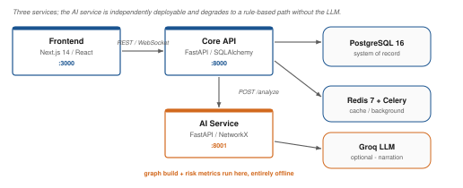
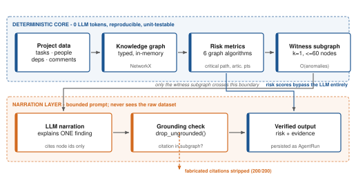
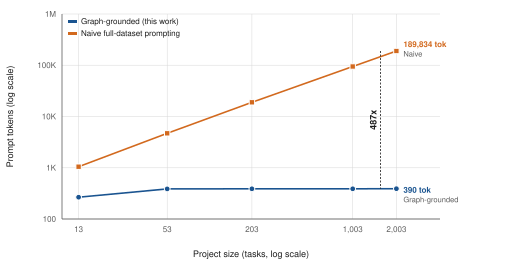

# TeamSync AI

**Explainable, Graph-Grounded Multi-Agent Project Intelligence**

TeamSync AI is a Kanban project-management platform with an AI layer that detects six kinds of
team coordination risk, explains each with mechanically verifiable evidence, and recommends
corrective actions — without ever handing your project's raw data to a language model.

> **The core idea:** don't ask an LLM to *find* risk in a pile of project data. Compute risk
> deterministically from a knowledge graph, then let the LLM only *narrate* one already-computed
> finding from a small, bounded slice of that graph. The LLM never sees or judges the raw
> dataset — it only explains an already-verified fact.

This yields two measured, headline properties: prompt cost that stays flat as the project grows
instead of scaling with it (**487× cheaper** than naive prompting at 2,000+ tasks), and evidence
citations that are mechanically checked rather than merely requested (**200/200** fabricated
references caught and stripped). A held-out real-world evaluation shows the zero-parameter graph
rule **beating a tuned machine-learning model** on unseen projects.

[**Read the full research write-up →**](IEEE_PAPER_REPORT.md) · [PDF version](IEEE_PAPER_REPORT.pdf)

---

## Table of Contents

- [The Problem](#the-problem)
- [The Approach](#the-approach)
- [Architecture](#architecture)
- [Key Results](#key-results)
- [Features](#features)
- [Technology Stack](#technology-stack)
- [Project Structure](#project-structure)
- [Getting Started](#getting-started)
- [Running Tests](#running-tests)
- [Datasets & Reproducing the Evaluation](#datasets--reproducing-the-evaluation)
- [Documentation](#documentation)
- [Known Limitations](#known-limitations)
- [Troubleshooting](#troubleshooting)
- [Roadmap](#roadmap)
- [License](#license)

---

## The Problem

Teams using conventional project-management tools (Jira, Linear, Asana, Monday.com) run into four
compounding failures:

1. **Risk is detected late.** Tools show current state, not risk trajectory. A silently
   overloaded engineer or a slipping critical-path task becomes visible only after the damage.
2. **Warnings are opaque.** When a tool flags something "at risk," it rarely shows *which
   evidence* produced that verdict, so a manager can neither act on it nor challenge it.
3. **Signals are siloed.** No single view reveals a cross-cutting risk such as "the only person
   who understands this component is also unresponsive and on the critical path."
4. **Naive AI fixes create new problems.** Feeding raw project data to an LLM is expensive (cost
   scales with project size), non-deterministic (same input, different verdicts), and produces
   justifications nobody can verify.

## The Approach

1. Compile project state into a **typed knowledge graph** (people, tasks, milestones,
   dependencies, comments) — from data the product already stores, no new collection required.
2. Compute all six risks as **deterministic graph algorithms** — zero LLM tokens, zero randomness.
3. For each detected anomaly, extract a small **witness subgraph** containing only the relevant nodes.
4. Give the LLM **only that subgraph** and ask it to *narrate* — never to decide.
5. **Mechanically verify** every citation against the subgraph; discard anything unresolvable.
6. Every agent has a **rule-based fallback** with an identical schema, so the whole pipeline works
   with no LLM configured at all — a genuine offline/zero-cost demo mode, not a degraded one.

| Risk type | How it's detected |
|---|---|
| Dependency / critical path | Longest path through the task-dependency DAG |
| Dependency concentration | Betweenness centrality of task nodes |
| Knowledge / single point of failure | Articulation points in the person↔component graph |
| Workload imbalance | Weighted degree over story-point assignments |
| Coordination gaps | Community structure over the collaboration graph |
| Silent members | Comment activity ÷ assignment load |

## Architecture

**Three independently deployable services**, connected as follows:



The part that matters is the **analysis pipeline** inside the AI service — this is the core
contribution:



Steps A–D and the risk *scores* involve **no LLM call at all**. Only the narration step touches
the model, and only on a bounded slice of the graph — which is what makes prompt cost scale with
the number of anomalies found, not with how large the project is.

| Service | Technology | Port | Role |
|---|---|---|---|
| **Frontend** | Next.js 14, React 18, Tailwind, TypeScript | 3000 | UI, Kanban board, dashboards, WebSocket client |
| **Core API** | FastAPI, SQLAlchemy 2.0 (async), Pydantic v2 | 8000 | Auth, CRUD, multi-tenancy, persistence |
| **AI Service** | FastAPI, NetworkX, Groq client | 8001 | Knowledge-graph build, risk metrics, agent pipeline |
| Database | PostgreSQL 16 (SQLite for tests/local) | 5432 | System of record |
| Cache / queue | Redis 7 + Celery | 6379 | Caching, background tasks |

## Key Results

Every number below is measured and reproducible — see [Reproducing the Evaluation](#datasets--reproducing-the-evaluation).

| Metric | Result |
|---|---|
| Prompt-token growth vs. project-size growth | **1.47× tokens for a 154× larger project** |
| Prompt-token reduction vs. naive full-dataset prompting | **99.8% (487×)** at 2,003 tasks |
| Held-out real-world F1 (TAWOS, 22 unseen projects) | **0.712** — beats a tuned ML model's 0.593 |
| Detection accuracy: graph vs. naive prompting (controlled ablation) | **1.000 vs 0.947** |
| Evidence-grounding enforcement | **200/200** fabricated citations stripped |
| LLM-narration vs. deterministic-verdict agreement (Cohen's κ) | **0.95** |
| Deterministic pipeline latency (p50, 203 tasks) | **~11 ms** |



Three separate attempts to improve accuracy with more sophisticated methods (threshold tuning,
individualized due-date estimation, a trained logistic-regression composite score) **all failed
or backfired** on held-out data — reported prominently because it's what makes the headline claim
credible rather than cherry-picked. Full details, all metrics, and the independent re-audit of
every number: [IEEE_PAPER_REPORT.md](IEEE_PAPER_REPORT.md).

## Features

**Product**
- Organization-based multi-tenancy with JWT auth and refresh rotation
- Role-based permissions (owner, admin, project manager, developer, viewer) checked on every
  change; nobody can grant a role above their own
- Projects with sprints (start and end dates, work done against time elapsed), health/risk scores,
  and a drag-and-drop Kanban board that filters by sprint
- Task dependencies (with real multi-hop cycle detection), subtasks, comments
- Real-time updates via WebSocket

**AI intelligence layer**
- Five active specialist agents (Planning, Progress, Workload, Risk, Recommendation)
- Deterministic, zero-token risk scoring with optional LLM narration on top
- Early warning: a burn-down projection flags sprints falling behind pace before their deadline
  (AUC 0.79 halfway through a sprint on 22 held-out real projects)
- Rule-based fallback for every agent — fully functional with no API key configured
- Mechanically enforced evidence grounding on every recommendation
- Full audit trail: every analysis run persists its specialist outputs, risk scores, and the
  exact witness subgraph used to produce them

**Deliberately deferred** (documented scope, not a hidden gap): Meeting Intelligence and
Communication Intelligence (no transcript/chat data source exists in the product yet), a
multi-agent Review Trio, Organizational Memory/RAG, per-project roles, persistent graph storage.

## Technology Stack

| Layer | Technologies |
|---|---|
| Frontend | Next.js 14 (App Router), React 18, TypeScript, Tailwind CSS, shadcn/ui, TanStack Query, Zustand, Socket.io, Recharts |
| Core backend | FastAPI, SQLAlchemy 2.0 (async), Pydantic v2, JWT auth, Celery, Redis, Alembic |
| AI service | FastAPI, NetworkX (graph engine), Groq client (LLM) |
| Database | PostgreSQL 16 in production; SQLite for tests and Docker-free local runs |
| Infra | Docker Compose (local), Kubernetes manifests (`k8s/`) |
| Testing | pytest (backend, AI service), vitest (frontend) |
| Quality | ruff, mypy, eslint, prettier, tsc |

## Project Structure

```
MULTI-AGENT/
├── frontend/              Next.js app (Kanban board, dashboards, AI insights panel)
├── backend/                Core API — auth, projects, tasks, multi-tenancy
│   └── app/scripts/seed.py  Demo-data seeder (6 users, 3 projects, 45 tasks)
├── ai-service/              Knowledge graph + multi-agent analysis pipeline
│   ├── app/graph/           GraphBuilder, GraphMetrics, SubgraphSelector, grounding
│   ├── app/agents/          Planning / Progress / Workload / Risk / Recommendation agents
│   └── eval/                 Full evaluation harness — every number in this README is reproducible here
├── docs/images/             Architecture and evaluation figures (this README)
├── k8s/                     Kubernetes manifests
├── IEEE_PAPER_REPORT.md      Consolidated research write-up (architecture, novelty, all metrics)
├── PROJECT_RESEARCH_DOSSIER.md  Fuller dossier: use cases, data model, glossary
└── docker-compose.yml
```

## Getting Started

### Option A — Docker (recommended, matches production topology)

```bash
git clone https://github.com/sanjaykumar-nb/FYP1.git
cd FYP1
cp .env.example .env          # GROQ_API_KEY is optional — the app is fully functional without one
make up
make db-migrate
make db-seed                  # 1 org, 6 demo users, 3 projects, 45 tasks with real dependency/workload risk
```

- Frontend: http://localhost:3000 — log in as `pm@demo.com` / `password123`
- Core API docs: http://localhost:8000/docs
- AI service docs: http://localhost:8001/docs

### Option B — Without Docker

Each service can run standalone against SQLite; useful for quick local development or if Docker
isn't available.

```bash
# 1. AI service
cd ai-service
pip install -r requirements.txt
python -m uvicorn app.main:app --port 8001

# 2. Core backend (new terminal)
cd backend
pip install -r requirements.txt
export DATABASE_URL="sqlite+aiosqlite:///./dev.db"
export JWT_SECRET="dev-secret-key-at-least-32-characters-long"
python -m app.scripts.seed              # optional but recommended — populates demo data
python -m uvicorn app.main:app --port 8000

# 3. Frontend (new terminal)
cd frontend
npm install
npm run dev
```

Then visit http://localhost:3000 and log in with `pm@demo.com` / `password123` (or register a
new account). Open a project → **AI Insights** tab → **Run Analysis**.

### See it on a real sprint

The seed data above is invented. To watch the system analyse **real project history** — sprint 74
of Apache Mesos from the TAWOS dataset, loaded through the app's own API — run this with the backend
and AI service up:

```bash
cd backend
python -m app.scripts.import_real_sprint app/scripts/fixtures/mesos_sprint_74.json
```

It prints a login for the imported project. On the board you can open the sprint's real blocking
links and discussions, and **AI Insights** shows every finding with the exact issues and people it
rests on. The workload recommendation comes with reassignments you can apply in one click; run the
analysis again and the scores that changed are marked. Add `--at 0.5` to replay the sprint as it stood
halfway through: nothing is overdue yet, and AI Insights already warns that it is behind pace. The
full walkthrough, including what is real and what the replay derives, is in [DEMO.md](DEMO.md).

## Running Tests

```bash
make test               # everything
make test-backend       # backend: 29/29
make test-ai            # AI service: 43/43 (pytest -m mvp)
make test-frontend      # frontend: 27/27 (vitest)
```

Or per-service, without Docker:

```bash
cd backend && python -m pytest -q
cd ai-service && python -m pytest -q -m mvp
cd frontend && npx vitest run
```

## Datasets & Reproducing the Evaluation

The real-world evaluation uses **TAWOS** (Tawosi, Al-Subaihin, Moussa & Sarro, MSR 2022,
Apache 2.0) — 458,232 real Jira issues across 39 open-source projects. It is not redistributed in
this repository (4.3 GB); see `ai-service/eval/datasets/` for the loader and required citation.

Every number in this README and in `IEEE_PAPER_REPORT.md` is reproducible from committed scripts:

```bash
cd ai-service
python -m eval.run_eval                     # synthetic detection, token scaling, latency, grounding
python -m eval.boundary_eval                 # threshold-boundary sensitivity
python -m eval.datasets.tawos_load           # TAWOS .sql -> SQLite (needs the raw dump, ~4.3GB)
python -m eval.datasets.tawos_split          # fixed project-level train/held-out split
python -m eval.datasets.tawos_score          # all-987-sprint result
python -m eval.datasets.tawos_holdout_eval   # the one-shot held-out headline number
python -m eval.ablation_naive_vs_graph       # graph vs. naive prompting, controlled comparison
python -m eval.live_llm_eval                 # schema validity + LLM-vs-deterministic agreement
python -m eval.make_figures                  # regenerate every figure in docs/images/ (offline)
```

## Documentation

| Document | What it covers |
|---|---|
| [IEEE_PAPER_REPORT.md](IEEE_PAPER_REPORT.md) ([PDF](IEEE_PAPER_REPORT.pdf)) | Consolidated research reference — problem, novelty, architecture, every measured metric, IEEE section mapping |
| [PROJECT_RESEARCH_DOSSIER.md](PROJECT_RESEARCH_DOSSIER.md) ([PDF](PROJECT_RESEARCH_DOSSIER.pdf)) | Fuller dossier — concrete use cases, full data model, security posture, glossary |
| [PROJECT_REPORT.pdf](PROJECT_REPORT.pdf) | Standalone illustrated report with all figures |
| [MVP_OVERVIEW.md](MVP_OVERVIEW.md) | Plain-language walkthrough of the MVP for a non-technical reader |
| `ai-service/eval/figures/README.md` | Figure sourcing, palette/accessibility rationale, LaTeX captions |

## Known Limitations

Stated explicitly rather than left implicit:

- **Roles are organization-wide.** Every change is checked against the caller's role, but a role
  applies to all projects in the organization; per-project roles are not implemented.
- **Only one of six risk types has real-world (non-synthetic) validation** — delay prediction,
  validated on TAWOS. The other five are validated against deterministic synthetic scenarios,
  which check implementation correctness, not real-world generalization.
- **The TAWOS delay label is a proxy** (the dataset has no due-date field), not a canonical
  "past due date" definition.
- **Meeting Intelligence and Communication Intelligence are unimplemented** — no transcript or
  chat/email data source exists in the product yet. A documented scoping decision.
- **Single LLM provider** (Groq) — cross-provider robustness is untested.

The full, unabridged threats-to-validity list (ten items) is in
[IEEE_PAPER_REPORT.md § Limitations](IEEE_PAPER_REPORT.md#9-limitations-and-threats-to-validity).

## Troubleshooting

- **Groq returns `model_not_found`.** Groq periodically deprecates models; `AI_MODEL` in
  `.env.example` reflects what worked at time of writing (`openai/gpt-oss-120b`). Check available
  models with `curl https://api.groq.com/openai/v1/models -H "Authorization: Bearer $GROQ_API_KEY"`
  and update `AI_MODEL` accordingly — or leave `GROQ_API_KEY` unset entirely; every agent has a
  full deterministic fallback and the app remains completely functional without an LLM.
- **`make up` fails / Docker not installed.** Use [Option B](#option-b--without-docker) — every
  service runs standalone against SQLite with no other dependency.
- **Login returns 422.** The login endpoint expects form-encoded credentials
  (`application/x-www-form-urlencoded`), not JSON — this is intentional (see
  `backend/app/api/v1/auth.py`).

## Roadmap

- Meeting Intelligence (transcript ingestion, evaluated against the AMI Meeting Corpus)
- Communication Intelligence (chat/email ingestion, evaluated against the Enron Email Corpus)
- Bootstrapped confidence intervals on the held-out evaluation
- A human evaluation of explanation quality/usefulness
- Per-project roles

## License

MIT — see [LICENSE](LICENSE). Third-party: Groq, NetworkX, FastAPI, SQLAlchemy, Pydantic,
Next.js, shadcn/ui, and the TAWOS dataset (Apache 2.0, MSR 2022 — citation required, see
`ai-service/eval/datasets/`).
